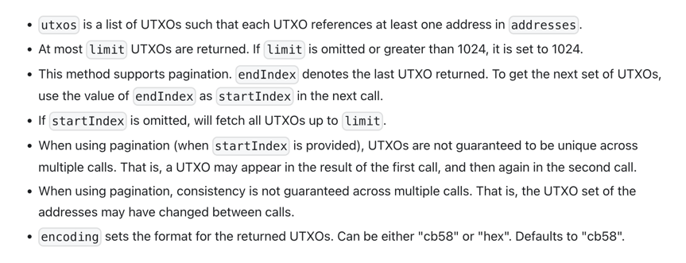

## avax-x解析cb58 utxo

## 获取utxos

### 请求

```shell
curl -X POST --data '{
    "jsonrpc":"2.0",
    "id"     :1,
    "method" :"avm.getUTXOs",
    "params" :{
        "addresses":["X-avax1yzt57wd8me6xmy3t42lz8m5lg6yruy79m6whsf", "X-avax1x459sj0ssujguq723cljfty4jlae28evjzt7xz"],
        "limit":5,
        "encoding": "cb58"
    }
}' -H 'content-type:application/json;' 127.0.0.1:9650/ext/bc/X
```

### 返回

```json
{
    "jsonrpc": "2.0",
    "result": {
        "numFetched": "5",
        "utxos": [
            "11PQ1sNw9tcXjVki7261souJnr1TPFrdVCu5JGZC7Shedq3a7xvnTXkBQ162qMYxoerMdwzCM2iM1wEQPwTxZbtkPASf2tWvddnsxPEYndVSxLv8PDFMwBGp6UoL35gd9MQW3UitpfmFsLnAUCSAZHWCgqft2iHKnKRQRz",
            "11RCDVNLzFT8KmriEJN7W1in6vB2cPteTZHnwaQF6kt8B2UANfUkcroi8b8ZSEXJE74LzX1mmBvtU34K6VZPNAVxzF6KfEA8RbYT7xhraioTsHqxVr2DJhZHpR3wGWdjUnRrqSSeeKGE76HTiQQ8WXoABesvs8GkhVpXMK",
            "11GxS4Kj2od4bocNWMQiQhcBEHsC3ZgBP6edTgYbGY7iiXgRVjPKQGkhX5zj4NC62ZdYR3sZAgp6nUc75RJKwcvBKm4MGjHvje7GvegYFCt4RmwRbFDDvbeMYusEnfVwvpYwQycXQdPFMe12z4SP4jXjnueernYbRtC4qL",
            "11S1AL9rxocRf2NVzQkZ6bfaWxgCYch7Bp2mgzBT6f5ru3XEMiVZM6F8DufeaVvJZnvnHWtZqocoSRZPHT5GM6qqCmdbXuuqb44oqdSMRvLphzhircmMnUbNz4TjBxcChtks3ZiVFhdkCb7kBNLbBEmtuHcDxM7MkgPjHw",
            "11Cn3i2T9SMArCmamYUBt5xhNEsrdRCYKQsANw3EqBkeThbQgAKxVJomfc2DE4ViYcPtz4tcEfja38nY7kQV7gGb3Fq5gxvbLdb4yZatwCZE7u4mrEXT3bNZy46ByU8A3JnT91uJmfrhHPV1M3NUHYbt6Q3mJ3bFM1KQjE"
        ],
        "endIndex": {
            "address": "X-avax1x459sj0ssujguq723cljfty4jlae28evjzt7xz",
            "utxo": "kbUThAUfmBXUmRgTpgD6r3nLj7rJUGho6xyht5nouNNypH45j"
        },
        "encoding": "cb58"
    },
    "id": 1
}
```



```text
encoding sets the format for the returned UTXOs. Can be either "cb58" or "hex". Defaults to "cb58".
```

返回值的编码类型只有cb58和hex类型，无法得到json类型。

## 解析

### golang 实现

```go
package avax_utils

import (
	"github.com/ava-labs/avalanchego/utils/formatting"
	"github.com/ava-labs/avalanchego/vms/components/avax"
	"github.com/ava-labs/avalanchego/vms/platformvm"
	"log"
	"testing"
)

func TestDecodeUtxo(t *testing.T) {
	utxoBytes, err := formatting.Decode(formatting.CB58, "11PQ1sNw9tcXjVki7261souJnr1TPFrdVCu5JGZC7Shedq3a7xvnTXkBQ162qMYxoerMdwzCM2iM1wEQPwTxZbtkPASf2tWvddnsxPEYndVSxLv8PDFMwBGp6UoL35gd9MQW3UitpfmFsLnAUCSAZHWCgqft2iHKnKRQRz")
	if err != nil {
		t.Fatal("formatting.Decode error", err)
	}

	utxo := avax.UTXO{}
	_, err = platformvm.Codec.Unmarshal(utxoBytes, &utxo)

	if err != nil {
		t.Fatal(err)
	}
	t.Log("utxo:", utxo)

	txid := utxo.TxID
	t.Log("txid:", txid)

	outputIndex := utxo.OutputIndex
	t.Log("outputIndex:", outputIndex)

	log.Printf("%+v", utxo.Out)
}

```

返回结果

```text
=== RUN   TestDecodeUtxo
    decode_test.go:23: utxo: {{2EAQ5JDvH6p9rEfNnTyQNKBcSj1AKLmTNvKu9YeR48o1yVXMRg 0 false [0 0 0 0 0 0 0 0 0 0 0 0 0 0 0 0 0 0 0 0 0 0 0 0 0 0 0 0 0 0 0 0]} {Q4KMfeLXTBgBpr367pRUuBzLoJqs2QtkvVJ6r4zV12HVj5K7X} 0xc0001dd200}
    decode_test.go:26: txid: 2EAQ5JDvH6p9rEfNnTyQNKBcSj1AKLmTNvKu9YeR48o1yVXMRg
    decode_test.go:29: outputIndex: 0
2022/05/17 14:48:16 &{Amt:1 OutputOwners:{Locktime:0 Threshold:1 Addrs:[DjU3SbP9ZfPW8YAvFdjivR4Hjfxu2VCLu] ctx:<nil>}}
--- PASS: TestDecodeUtxo (0.00s)
PASS
```